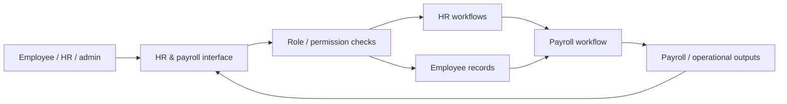
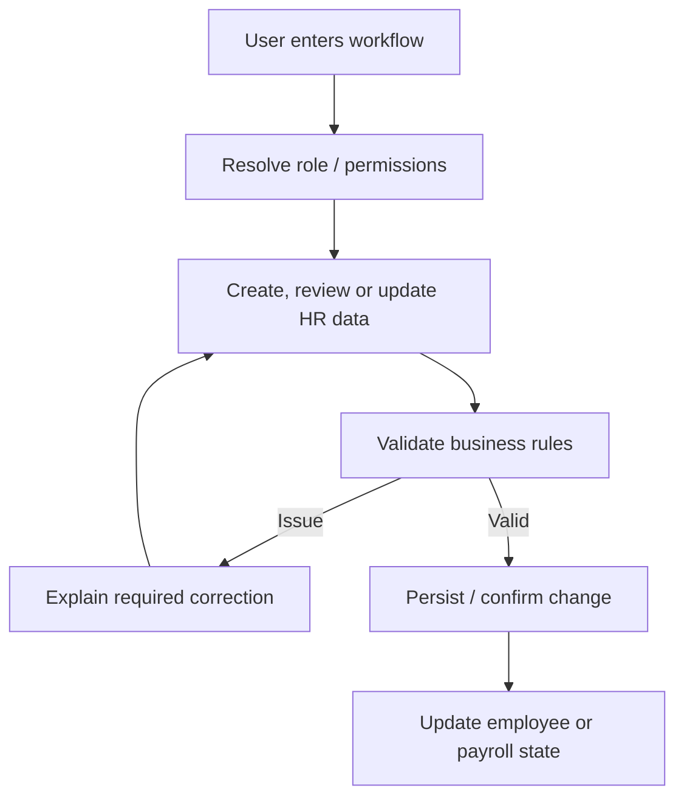
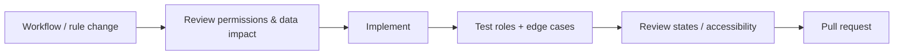

<div align="center">

# HR Payroll Management

**An HR operations product exploring employee onboarding, administration, permissions, attendance-related workflows, and payroll management.**


[Browse source](https://github.com/Nischhalsubba/HR-Payroll-Management/tree/main) · [Issues](https://github.com/Nischhalsubba/HR-Payroll-Management/issues)

</div>

## Overview

**HR Payroll Management** is documented as an operations system rather than just a collection of screens. The project map shows how employees, HR/admin users, business rules, records, permissions, and payroll outcomes relate to one another.

| Audience | Focus |
|---|---|
| Employees | Personal information, status and self-service workflows |
| HR / admins | Employee lifecycle, permissions, records and payroll operations |
| Developers | Domain rules, data state, authorization and UI behavior |
| Designers | Complex workflows, dense tables, states, errors and role clarity |

<details open>
<summary><strong>🏗️ Interactive HR architecture</strong></summary>



</details>

## Operational flow



## Getting started

```bash
git clone https://github.com/Nischhalsubba/HR-Payroll-Management.git
cd HR-Payroll-Management
```

Use the manifests and lockfiles in the repository to determine the current runtime and development commands.

## Product, security & accessibility

HR software handles sensitive information. Keep role boundaries explicit, expose only necessary data, validate changes, avoid leaking secrets or personal records, and preserve useful audit context. Interfaces should support keyboard use, visible focus, readable tables, error recovery, responsive layouts, and clear destructive-action confirmation.

## SEO & discoverability

If the project has public product pages, use accurate terms such as **HR management system, payroll management, employee management, HR operations, workforce administration, and payroll software** only where supported by implemented scope. Private application screens should not be indexed merely for the sake of SEO.

## Contribution flow


