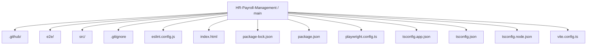
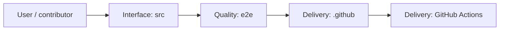
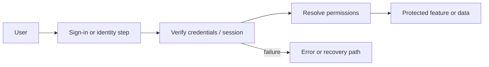
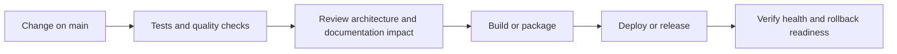
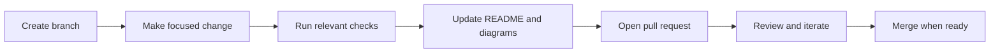

<!-- interactive-readme-standard:start -->

<div align="center">

# HR-Payroll-Management

**Branch-aware technical guide for [`main`](https://github.com/Nischhalsubba/HR-Payroll-Management/tree/main)**

<p>       </p>

<p>
  <a href="https://github.com/Nischhalsubba/HR-Payroll-Management/tree/main"><strong>Browse source</strong></a> ·
  <a href="https://github.com/Nischhalsubba/HR-Payroll-Management/issues"><strong>Issues</strong></a> ·
  <a href="https://github.com/Nischhalsubba/HR-Payroll-Management/codespaces/new?ref=main"><strong>Open in Codespaces</strong></a>
</p>

</div>

> [!IMPORTANT]
> This guide is generated from the files actually present on `main`. It links to detected source paths, preserves project-authored notes, and avoids claiming components that were not found.

## At a glance

| Item | Detected value |
|---|---|
| Purpose | A React and TypeScript HR payroll management frontend prototype with onboarding, auth, employee management, attendance, payroll, mock persistence, Vitest, and Playwright flows. |
| Branch role | Default branch |
| Stack | React, Vite, TypeScript, JavaScript, HTML, CSS |
| Manifests | package.json |
| Prerequisites | Node.js |
| Delivery | GitHub Actions |
| License | No license file detected |

## Branch scope

This is the repository's default branch.


## Quick start

```bash
npm install
npm run dev
npm run build
npm run test
npm run lint
```

### Configuration surface

- No committed environment example file was detected.

> Never commit secrets, private keys, production credentials, customer data, or unredacted infrastructure details.

## Repository map



| Responsibility | Detected source paths |
|---|---|
| Interface | [`src`](https://github.com/Nischhalsubba/HR-Payroll-Management/tree/main/src) |
| Quality | [`e2e`](https://github.com/Nischhalsubba/HR-Payroll-Management/tree/main/e2e) |
| Delivery | [`.github`](https://github.com/Nischhalsubba/HR-Payroll-Management/tree/main/.github) |

## Website or application map

```mermaid
flowchart TD
    APP["HR-Payroll-Management"]
    APP --> R0["src/app"]
    APP --> R1["src/pages"]
    R0 --> F0["src/app/AppRouter.tsx"]
    R1 --> F1["src/pages/OnboardingPage.tsx"]
    R1 --> F2["src/pages/auth/ForgotPasswordPage.tsx"]
    R1 --> F3["src/pages/auth/LoginPage.tsx"]
    R1 --> F4["src/pages/auth/ResetPasswordPage.tsx"]
    R1 --> F5["src/pages/auth/OtpPage.tsx"]
    R1 --> F6["src/pages/auth/SignupPage.tsx"]
    R1 --> F7["src/pages/app/SettingPage.tsx"]
    R1 --> F8["src/pages/app/AttendancePage.tsx"]
    R1 --> F9["src/pages/app/StubSectionPage.tsx"]
    R1 --> F10["src/pages/app/NotificationsPage.tsx"]
    R1 --> F11["src/pages/app/DashboardPage.tsx"]
```



## Architecture and responsibility flow



<details>
<summary><strong>Authentication and authorization flow</strong></summary>



Relevant detected files: [`e2e/auth-reset.spec.ts`](https://github.com/Nischhalsubba/HR-Payroll-Management/blob/main/e2e/auth-reset.spec.ts), [`src/layouts/AuthLayout.tsx`](https://github.com/Nischhalsubba/HR-Payroll-Management/blob/main/src/layouts/AuthLayout.tsx), [`src/tests/authFlow.test.tsx`](https://github.com/Nischhalsubba/HR-Payroll-Management/blob/main/src/tests/authFlow.test.tsx), [`src/services/authService.ts`](https://github.com/Nischhalsubba/HR-Payroll-Management/blob/main/src/services/authService.ts), [`src/context/AuthContext.tsx`](https://github.com/Nischhalsubba/HR-Payroll-Management/blob/main/src/context/AuthContext.tsx), [`src/pages/auth/ForgotPasswordPage.tsx`](https://github.com/Nischhalsubba/HR-Payroll-Management/blob/main/src/pages/auth/ForgotPasswordPage.tsx), [`src/pages/auth/LoginPage.tsx`](https://github.com/Nischhalsubba/HR-Payroll-Management/blob/main/src/pages/auth/LoginPage.tsx), [`src/pages/auth/ResetPasswordPage.tsx`](https://github.com/Nischhalsubba/HR-Payroll-Management/blob/main/src/pages/auth/ResetPasswordPage.tsx), [`src/pages/auth/OtpPage.tsx`](https://github.com/Nischhalsubba/HR-Payroll-Management/blob/main/src/pages/auth/OtpPage.tsx), [`src/pages/auth/SignupPage.tsx`](https://github.com/Nischhalsubba/HR-Payroll-Management/blob/main/src/pages/auth/SignupPage.tsx).

> The diagram expresses the responsibility sequence only. Confirm exact providers, token formats, roles, and recovery behavior in the linked source.

</details>

## Quality, security, and operations

<table>
<tr>
<td width="33%" valign="top">

### Quality

- [`e2e`](https://github.com/Nischhalsubba/HR-Payroll-Management/tree/main/e2e)

Detected commands:
- `npm run dev`
- `npm run build`
- `npm run test`
- `npm run lint`
- `npm run typecheck`
- `npm run preview`

</td>
<td width="33%" valign="top">

### Security

- No dedicated security policy or automated dependency configuration was detected.

Review authentication, authorization, input validation, dependency updates, secret handling, and failure recovery before release.

</td>
<td width="34%" valign="top">

### Observability

- No dedicated observability integration was detected automatically.

Define useful logs, metrics, traces, alerts, and rollback signals for production-facing branches.

</td>
</tr>
</table>

## Delivery flow



### Automation detected

- [`.github/workflows/apply-interactive-readme.yml`](https://github.com/Nischhalsubba/HR-Payroll-Management/blob/main/.github/workflows/apply-interactive-readme.yml)

## Contribution flow



- Keep changes focused and explain architectural consequences.
- Run the checks relevant to the changed area.
- Update diagrams whenever routes, modules, data models, authentication, jobs, or delivery paths change.
- Add screenshots or recordings for visual behavior changes when useful.
- Use issues for reproducible defects and pull requests for reviewable changes.

## Ownership and support

| Topic | Source |
|---|---|
| Repository | [`Nischhalsubba/HR-Payroll-Management`](https://github.com/Nischhalsubba/HR-Payroll-Management) |
| Branch | [`main`](https://github.com/Nischhalsubba/HR-Payroll-Management/tree/main) |
| Ownership | No CODEOWNERS file detected |
| Contributing | Use the contribution flow above |
| Support | [Open or review issues](https://github.com/Nischhalsubba/HR-Payroll-Management/issues) |
| License | No license file detected |

<details>
<summary><strong>Documentation maintenance checklist</strong></summary>

- [ ] Purpose and branch scope are accurate.
- [ ] Setup and configuration commands still work.
- [ ] Repository, application, API, data, authentication, job, and deployment diagrams match the code.
- [ ] Tests, security controls, observability, and rollback behavior are documented.
- [ ] Links point to real files on this branch.
- [ ] No secrets or private operational details are exposed.

</details>

<!-- interactive-readme-standard:end -->

<!-- project-authored-notes:start -->
<details>
<summary><strong>Project-authored notes preserved from this branch</strong></summary>

<div align="center">

# AtlasHR — HR Payroll Management Frontend

### Design-System-Driven HR Dashboard Experience

**A React + TypeScript + Vite frontend for an HR and payroll management product, featuring onboarding, authentication, employee management, attendance, payroll, notifications, profile, settings, mock persistence, and tested user flows.**


</div>

---

## ✨ Overview

**AtlasHR** is a frontend prototype for an HR Payroll Management product. It implements a design-system-driven dashboard experience with realistic mock-backed flows for onboarding, authentication, employee management, attendance, payroll, notifications, profile, settings, and protected app navigation.

The project is built with React 19, TypeScript, Vite 7, React Router 7, React Hook Form, Zod, Vitest, Testing Library, and Playwright.

This repo is useful as a strong frontend case study because it shows more than static screens. It includes real interaction patterns, route protection, local persistence, mock services, form validation, CRUD-like flows, and test coverage for important user journeys.

---

## 🧭 Table of Contents

- [Product Purpose](#-product-purpose)
- [Designer’s Perspective](#-designers-perspective)
- [Tech Stack](#-tech-stack)
- [Implemented Flows](#-implemented-flows)
- [Routes](#-routes)
- [Mock Data and Persistence](#-mock-data-and-persistence)
- [Design System Direction](#-design-system-direction)
- [Testing](#-testing)
- [Quick Start](#-quick-start)
- [Scripts](#-scripts)
- [Quality Checklist](#-quality-checklist)
- [Roadmap](#-roadmap)

---

## 🎯 Product Purpose

AtlasHR is designed to simulate the core frontend experience of a modern HR and payroll system.

The product supports common HR workflows such as:

- employee onboarding
- login and account recovery
- dashboard navigation
- employee records
- attendance tracking
- payroll records
- notifications
- profile editing
- settings management

The goal is to make HR operations feel organized, predictable, and easy to navigate.

---

## 🎨 Designer’s Perspective

This project is written from the perspective of a product designer who understands frontend implementation.

An HR/payroll system should not feel like a collection of random admin pages. It should feel like one connected operational workspace.

The most important UX goals are:

- clear navigation
- predictable page structure
- readable employee data
- fast access to payroll/attendance sections
- visible notifications
- simple profile/settings management
- strong form validation
- helpful empty states
- mock flows that behave like real product flows

The app also keeps the original Figma-aligned navigation wording, including the intentionally spelled `Attandence` route/label, while adding legacy redirects for corrected/common routes.

---

## 🛠 Tech Stack

| Layer | Technology | Purpose |
|---|---|---|
| UI | React `19.2.0` | Component-based frontend |
| Language | TypeScript `5.9.x` | Type-safe app logic |
| Build Tool | Vite `7.3.x` | Fast development and production builds |
| Routing | React Router DOM `7.13.0` | Public/protected route structure |
| Forms | React Hook Form | Form state and validation integration |
| Validation | Zod | Schema-based form validation |
| Unit Testing | Vitest | Component and logic tests |
| UI Testing | Testing Library | User-focused component tests |
| E2E Testing | Playwright | Browser-level flow testing |
| Linting | ESLint | Code quality |

---

## 🧩 Implemented Flows

### 1. Onboarding

- 3-slide mobile shell onboarding
- `Next`, `Back`, `Skip`, `Get Started`
- Keyboard arrow support
- Touch swipe support
- Onboarding completion persisted in localStorage

### 2. Authentication

- Login
- Sign-up
- Forgot password
- OTP verification
- Reset password
- OTP auto-advance
- OTP paste handling
- OTP backspace behavior
- Countdown + resend behavior

### 3. App Shell and Navigation

Figma-aligned sidebar labels:

| Main Navigation | Secondary Navigation |
|---|---|
| Dashboard | Setting |
| Attandence | Help Center |
| Employees |  |
| Payroll |  |
| Payslip |  |
| Payroll Calendar |  |
| Report & Analytics |  |
| Vacancies |  |
| Applicants |  |
| Leaves |  |

Shell behavior includes:

- collapsible desktop sidebar
- mobile sidebar drawer with overlay
- search suggestions in top navigation
- notification bell dropdown with unread badge
- page transition animations

### 4. Core Pages

| Page | Implemented Behavior |
|---|---|
| Employees | Mock CRUD, search/filter/sort, status tabs, pagination, row actions |
| Attandence | Grid/list/detail variants |
| Payroll | Interactive records, filters, actions |
| Notifications | Dropdown + full list + detail view actions |
| Profile | Editable personal info, security/password update, avatar mock update |
| Setting | Tabbed settings with unsaved-change guard, save/reset defaults |
| Remaining sections | Interactive stubs with non-dead actions |

---

## 🧭 Routes

### Public Routes

| Route | Purpose |
|---|---|
| `/onboarding` | First-time onboarding flow |
| `/auth/login` | Login screen |
| `/auth/sign-up` | Sign-up screen |
| `/auth/forgot-password` | Forgot password request |
| `/auth/otp` | OTP verification |
| `/auth/reset-password` | Reset password screen |

### Protected Routes

| Route | Purpose |
|---|---|
| `/app/dashboard` | Main dashboard |
| `/app/attandence` | Attendance overview |
| `/app/attandence/list` | Attendance list view |
| `/app/attandence/detail/:employeeId` | Attendance detail |
| `/app/employees` | Employee management |
| `/app/employees/detail/:employeeId` | Employee detail |
| `/app/payroll` | Payroll records |
| `/app/payslip` | Payslip section |
| `/app/payroll-calendar` | Payroll calendar |
| `/app/report-analytics` | Reports and analytics |
| `/app/vacancies` | Vacancies section |
| `/app/applicants` | Applicants section |
| `/app/leaves` | Leaves section |
| `/app/setting` | Settings |
| `/app/help-center` | Help center |
| `/app/notifications` | Notifications list |
| `/app/notifications/:notificationId` | Notification detail |
| `/app/profile` | User profile |

### Legacy Redirects

| Legacy Route | Redirects To |
|---|---|
| `/app/attendance` | `/app/attandence` |
| `/app/attendance/list` | `/app/attandence/list` |
| `/app/attendance/detail/:employeeId` | `/app/attandence/detail/:employeeId` |
| `/app/calendar` | `/app/payroll-calendar` |
| `/app/reports` | `/app/report-analytics` |
| `/app/departments` | `/app/vacancies` |
| `/app/help` | `/app/help-center` |
| `/app/settings` | `/app/setting` |

---

## 💾 Mock Data and Persistence

The project uses mock-backed behavior to simulate a real HR product.

Persisted in `localStorage`:

- session state
- onboarding completion
- notifications
- profile
- settings

Mock/in-memory flows:

- employee behavior
- auth behavior
- deterministic service responses

This makes the prototype feel interactive without requiring a backend.

---

## 🎨 Design System Direction

AtlasHR is designed as an operational dashboard, so the design should prioritize:

- clear sidebar hierarchy
- readable tables
- helpful filters
- consistent forms
- predictable action placement
- accessible modal/drawer behavior
- visible status badges
- friendly validation states
- responsive management screens

The interface should feel calm and structured because HR and payroll workflows involve sensitive employee information and repeated daily operations.

---

## 🧪 Testing

Run all major checks:

```bash
npm run lint
npm run build
npm run test:run
npm run test:e2e
```

Current test coverage includes:

- auth reset flow
- onboarding flow
- employee CRUD/smoke journeys

Recommended future test coverage:

- settings unsaved-change guard
- notification read/unread behavior
- mobile sidebar drawer behavior
- protected route redirects
- payroll filter interactions
- profile edit validation

---

## 🚀 Quick Start

### 1. Install dependencies

```bash
npm install
```

### 2. Run local dev server

```bash
npm run dev
```

### 3. Open the app

```text
http://localhost:5173
```

---

## 📜 Scripts

| Command | Purpose |
|---|---|
| `npm run dev` | Start development server |
| `npm run build` | Type-check and create production build |
| `npm run lint` | Run ESLint |
| `npm run preview` | Preview production build |
| `npm run test` | Run Vitest in watch mode |
| `npm run test:run` | Run Vitest once |
| `npm run test:e2e` | Run Playwright end-to-end tests |

---

## ✅ Quality Checklist

### UX QA

- [ ] Onboarding works with click, keyboard, and swipe.
- [ ] Auth screens have clear errors and validation.
- [ ] OTP interaction supports typing, paste, backspace, and resend.
- [ ] Sidebar collapse/expand works.
- [ ] Mobile drawer works with overlay.
- [ ] Employee table supports search, filter, sort, and pagination.
- [ ] Settings warn about unsaved changes.
- [ ] Notifications show read/unread state clearly.

### Technical QA

- [ ] `npm install` works.
- [ ] `npm run dev` works.
- [ ] `npm run build` succeeds.
- [ ] `npm run lint` passes or known issues are documented.
- [ ] `npm run test:run` passes.
- [ ] `npm run test:e2e` passes.
- [ ] localStorage reset does not break the app.

### Design QA

- [ ] Dashboard layout feels balanced.
- [ ] Tables are readable on common laptop widths.
- [ ] Mobile screens are usable.
- [ ] Buttons and forms have consistent spacing.
- [ ] Status badges are understandable.
- [ ] Empty states are helpful.

---

## 🗺 Roadmap

- Connect to a real backend API.
- Add role-based permissions.
- Add real payroll calculation logic.
- Add attendance import/export.
- Add employee document management.
- Add richer reports and analytics charts.
- Add audit logs for sensitive actions.
- Add stronger accessibility coverage.
- Add production-ready auth/token handling.

---

<div align="center">

Built as a polished HR dashboard frontend prototype with real interaction depth, not just static screens.

</div>

</details>
<!-- project-authored-notes:end -->
